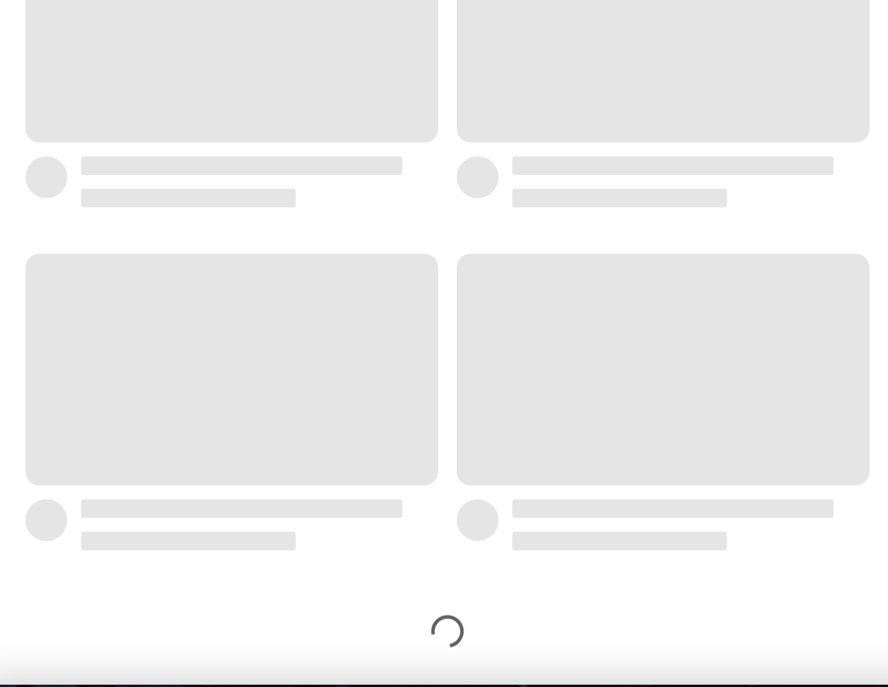

# 사용자의 경험을 좋게하는 Skeleton UI 구현해보기

## 2주차(23/03/21 ~ 23/03/27) 챌린지입니다!

</img>

유튜브 사이트의 Skeleton UI를 직접 구현해보기

- 📌 Skeleton UI 필요성 개념 이해하기
  - https://tech.kakaopay.com/post/skeleton-ui-idea/
  - https://ui.toast.com/weekly-pick/ko_20201110
- 📌 모바일 환경에서도 자연스럽게 반응하도록 구현
- 📌 애니메이션 구현해보기

여기 경로에 각자의 이름으로 PR 올려주세요!

# ETC

- [더미 이미지 사이트](https://picsum.photos/)
