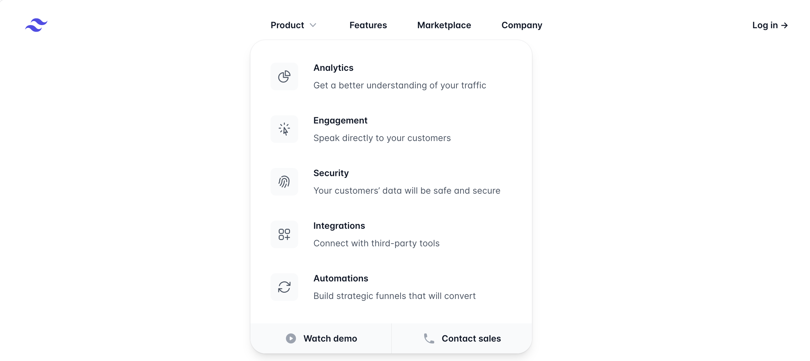

# 가독성 좋은 Header CSS 작성하기

## 첫 주차(23/03/14 ~ 23/03/20) 챌린지입니다! (처음은 쉬운 미션)

> https://tailwindui.com/components/marketing/elements/headers

</img>

위 사이트의 헤더를 유지보수하기 쉬운 형태의 CSS 구조로 만들어보기.

- 📌 반응형 고려하기 (Mobile First!)
- 📌 최소한의 HTML 마크업을 사용하기
- 📌 새로운 메뉴 추가, 다크모드 추가에 대응하기 쉬운 CSS 생각해보기
- 🧐 (advanced) 모바일 뷰에서는 햄버거 버튼으로 메뉴를 접근할 수 있어야함.

여기 경로에 각자의 이름으로 PR 올려주세요!
